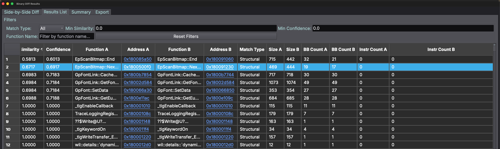

# Binary Diffing Plugin for Binary Ninja

A high-performance binary diffing plugin for Binary Ninja that compares functions between two binaries using advanced structural and semantic analysis. Built with Rust for performance and Python for Binary Ninja integration.

## Binary Diffing Example
Example Marimo notebook analysis of CVE-2025-53766 GDI+ Remote Code Execution Vulnerability using the Rust Diff plugin for Binary Ninja https://github.com/meerkatone/patch_chewsday_cve_2025_53766



## Features

- **Multiple export formats**: JSON, CSV, SQLite, HTML reports
- **Optional Qt GUI**: Interactive results table with sorting and filtering
- **Cross-platform**: Supports Darwin, Linux, and Windows

## Installation

### Prerequisites

- [Binary Ninja](https://binary.ninja/) (Commercial or Personal license latest dev build)
- [Rust toolchain](https://rustup.rs/) (latest stable)
- Binary Ninja API development headers
- Python 3.x
- Optional: PySide6 or PySide2 (for GUI features)

### Build and Install

1. Clone this repository:
   ```bash
   git clone https://github.com/meerkatone/rust_diff.git
   cd rust_diff
   ```

2. Set up Binary Ninja environment (if needed):
   ```bash
   export BINJA_DIR="/path/to/your/binaryninja/installation"
   ```

3. Build the plugin:
  ```bash
  # Clone and build the Rust library
  cargo build --release

  If the plugin fails to load due to the following error message "This plugin was built for an outdated core ABI (XXX). Please rebuild the plugin with the latest API (XXX)." Please use the following to update the dependencies:
  cargo update && cargo build --release

  # Install GUI dependencies (optional)
  pip install PySide6
  # or
  python install_pyside.py
  ```

4. Copy the compiled plugin to Binary Ninja's plugin directory:
   ```bash
   # macOS
   cp target/release/librust_diff.dylib ~/Library/Application\ Support/Binary\ Ninja/plugins/
   
   # Linux
   cp target/release/librust_diff.so ~/.binaryninja/plugins/
   
   # Windows
   copy target\release\librust_diff.dll %APPDATA%\Binary Ninja\plugins\
   ```

5. Restart Binary Ninja to load the plugin

## Usage

1. Open a binary in Binary Ninja
2. Go to Tools → Binary Diffing (Rust)
3. Select a target BNDB file to compare against
4. The plugin will analyze both binaries and display results

## Side by Side Diff View

The plugin includes a side by side diff view for detailed function comparison:

- **Interactive comparison**: View decompiled code from both binaries side by side
- **Synchronized scrolling**: Navigate through both versions simultaneously
- **Similarity scoring**: See detailed match percentages and analysis metrics
- **Context preservation**: Understand changes in the context of surrounding code

To use the side by side view:
1. Run the binary diff analysis as described above
2. In the results table, double-click any function pair or select a row and click "View Side by Side"
3. The diff view will open showing both versions of the function with highlighting for differences
