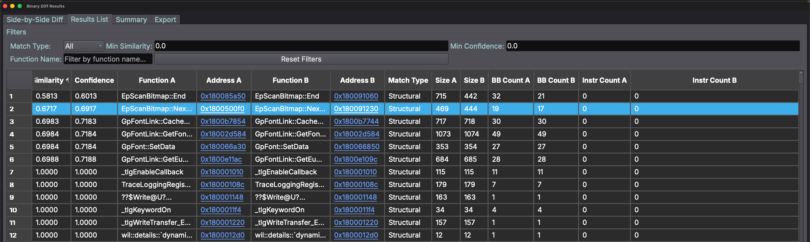

# Binary Diffing Plugin for Binary Ninja

A high-performance binary diffing plugin for Binary Ninja that compares functions between two binaries using advanced structural and semantic analysis. Built with Rust for performance and Python for Binary Ninja integration.

## Binary Diffing Example
Example Marimo notebook analysis of CVE-2025-53766 GDI+ Remote Code Execution Vulnerability using the Rust Diff plugin for Binary Ninja https://github.com/meerkatone/patch_chewsday_cve_2025_53766



## Features

- **Side by Side Diff View**: View diff of the ILs, and Pseudo C
- **Semantic (IL-aware) diff**: Normalizes volatile tokens and resolves matched-callee renames, so a *renamed* call reads as cosmetic while a *replaced* call is flagged as a real change — a distinction a plain textual diff cannot make
- **Analysis transfer (A → B)**: Copy names, prototypes/types, comments, and variable names/types from matched functions onto another binary, as a single undo action (scope by row selection)
- **On-demand IL refinement**: A bounded post-match pass uses semantic IL similarity to re-rank weak matches and rescue ones the disassembly heuristics missed
- **Multiple export formats**: JSON, CSV, SQLite, HTML reports
- **Optional Qt GUI**: Interactive results table with sorting and filtering
- **Cross-platform**: Supports Darwin, Linux, and Windows

## Semantic IL diff API

The IL-aware diff is exposed over the C FFI and is callable from the Python
frontend without Binary Ninja in the loop:

- Rust FFI: `rust_diff_il_diff_json(request_json) -> *mut c_char` — takes an
  `il::IlDiffRequest` (two IL token streams plus an optional callee rename map)
  and returns an `il::IlDiff` JSON string (free with `rust_diff_free_string`).
- Python helpers in `__init__.py`: `extract_il_function(func, level)` builds the
  typed token stream for one function at "LLIL"/"MLIL"/"HLIL"; `il_diff(il_a,
  il_b, rename_map)` runs the diff. In the GUI, choose **Diff Mode → Semantic
  (IL-aware)** on any IL/Pseudo-C view.

Transfer lives in `transfer.py` (`plan_transfer` / `apply_transfer`) and is
driven from the results window's **Transfer Analysis (Binary A → Binary B)**
panel.

## Installation

### Prerequisites

- [Binary Ninja](https://binary.ninja/) (Commercial or Personal license latest dev build)
- [Rust toolchain](https://rustup.rs/) (latest stable)
- Python 3.x
- Optional: PySide6 or PySide2 (for GUI features)

### Build and Install

1. Clone this repository:
   ```bash
   git clone https://github.com/meerkatone/rust_diff.git
   cd rust_diff
   ```

2. Build the Rust engine:
   ```bash
   cargo build --release

   # Install GUI dependencies (optional)
   pip install PySide6
   # or
   python install_pyside.py
   ```

   The Rust engine communicates with the Python frontend exclusively through
   JSON FFI and does not link against `libbinaryninjacore`. It can therefore be
   built on a machine without Binary Ninja installed and does not need to be
   rebuilt when switching between stable and development Binary Ninja builds.

3. Place the whole plugin directory (this repository) in Binary Ninja's
   plugin directory. The Python frontend loads the Rust engine directly from
   `target/release/` inside the plugin folder — no extra copy step is needed:
   - macOS: `~/Library/Application Support/Binary Ninja/plugins/rust_diff/`
   - Linux: `~/.binaryninja/plugins/rust_diff/`
   - Windows: `%APPDATA%\Binary Ninja\plugins\rust_diff\`

   Building in place creates `target/` and Python may create `__pycache__/`;
   both are ignored by git and can be left in the plugin directory.

4. Restart Binary Ninja to load the plugin.

If Binary Ninja logs `Failed to load Rust diff engine`, run
`cargo build --release` in the plugin directory and restart Binary Ninja.

### Verifying the engine

Run the standalone end-to-end test (no Binary Ninja required):
```bash
cargo build --release && python3 test_ffi.py
```

## Worked example: stripped patch-diff of a signedness `memcpy` bug

`examples/memcpy_diff/` contains a self-contained pair that exercises the
lower-tier matching phases *and* the semantic IL diff on a real bug class.

```bash
cd examples/memcpy_diff
./build.sh          # builds stripped v1 (vulnerable) and v2 (patched)
```

Both builds are **stripped**, so the `static` helper functions become `sub_*`
and must be matched without symbols — forcing the MD-Index / Small-Primes /
Structural / Call-Graph phases instead of `Name`. The star is `copy_record()`,
whose length is a *signed `int`*: a negative value (e.g. `atoi("-1")`)
sign-extends to a huge `size_t` in `memcpy`'s third argument.

```c
// v1 (vulnerable): no check; signed len sign-extends
memcpy(dst, src, len);
// v2 (patched): reject negative / oversized before the copy
if (len < 0 || len > 64) return -1;
memcpy(dst, src, (size_t)len);
```

Runtime confirms it: `./v1 -1` segfaults (huge copy), `./v2 -1` returns safely.

Load `v1` and `v2` in Binary Ninja and run the plugin. In **Results List** you
will see `Exact` (byte-identical functions such as `validate`), `MdIndex` /
`Structural` (the equivalent-but-edited `checksum`/`transform`), and
`CallGraph` (the patched `copy_record`, anchored from its caller `encode`).

Open the `copy_record` pair and switch **Diff Mode → Semantic (IL-aware)**. The
diff isolates the fix, including the tell at the IL level — the size argument
changes from `sx.q` (sign-extend) to `zx.q` (zero-extend) plus the new bound
check — which is exactly the signedness fix and is the kind of change a plain
textual diff would blur.

## Matching algorithms

Python only extracts per-function features (basic blocks, instruction
mnemonics/operands, CFG edges, callers/callees); all matching runs in Rust.
Phases run from strongest evidence to weakest, each consuming only functions
the previous phases left unmatched:

1. **Exact** — identical instruction-content hash + Weisfeiler-Lehman labeled
   CFG hash + local call-graph degrees (confidence 1.0).
2. **Name** — identical real (non-placeholder) symbol names; similarity is
   reported but does not gate the match.
3. **MD-Index** — the BinDiff/Diaphora topological edge fingerprint
   (topological order plus in/out degrees per edge, summed as 1/sqrt of a
   prime-weighted embedding).
4. **Small primes product** — Diaphora-style SPP: one fixed prime per
   mnemonic, multiplied modulo 2^61-1 so the order-independent equality
   property holds for functions of any size.
5. **Structural** — WL labeled-graph hash equality (instructions may differ
   freely); requires at least 3 basic blocks.
6. **Call-graph propagation** — BinDiff-style drill-down: unmatched
   callees/callers of already-matched pairs are compared against each other
   with relaxed thresholds, iterating to a fixed point.
7. **Fuzzy** — weighted multi-metric similarity over whatever remains
   (functions with at least 5 instructions only).

Confidence is assigned per algorithm (BinDiff-style), and all phases are
deterministic: identical inputs produce identical results across runs.

After the bulk match, a bounded **on-demand IL refinement** pass extracts IL
(MLIL) only for a small candidate set — weak matches (low confidence /
non-strong types) and a few size-near unmatched pairs — and uses semantic IL
similarity to re-rank those weak matches and to *rescue* matches the
disassembly heuristics missed (reported with match type `IL`). It is capped so
large binaries stay responsive and is skipped entirely when nothing is weak or
unmatched.

The reported overall similarity is coverage-adjusted: unmatched functions
contribute zero. Results also expose `matched_similarity_score` (the mean over
matched pairs) and `match_coverage` so a small shared subset cannot make two
otherwise unrelated binaries appear identical.

## Usage

1. Open a binary in Binary Ninja
2. Go to Tools → Binary Diffing (Rust)
3. Select a target BNDB file to compare against
4. The plugin will analyze both binaries and display results

## Side by Side Diff View

The plugin includes a side by side diff view for detailed function comparison:

- **Interactive comparison**: View decompiled code from both binaries side by side
- **Synchronized scrolling**: Navigate through both versions simultaneously
- **Similarity scoring**: See detailed match percentages and analysis metrics
- **Context preservation**: Understand changes in the context of surrounding code

To use the side by side view:
1. Run the binary diff analysis as described above
2. In the results table, double-click any function pair or select a row and click "View Side by Side"
3. The diff view will open showing both versions of the function with highlighting for differences
